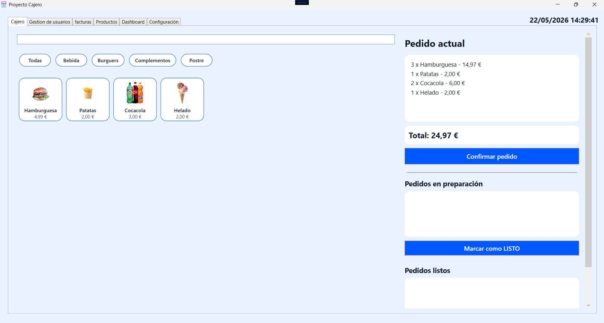
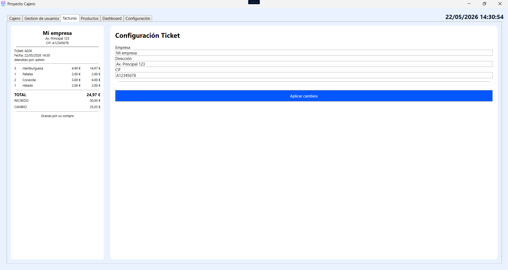
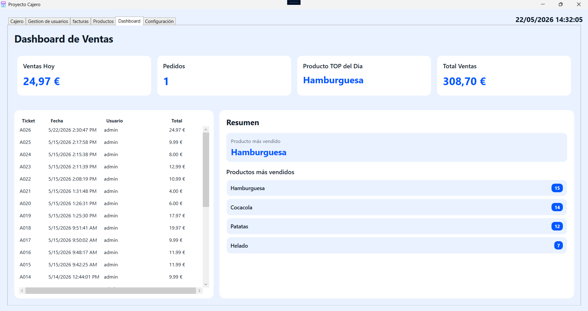

```md
# CajeroPOS - Sistema TPV para Restaurantes

## Descripción del proyecto

CajeroPOS es una aplicación TPV/POS desarrollada en C# y WPF orientada a restaurantes y pequeños comercios de comida rápida.

El sistema permite gestionar ventas, productos, categorías, usuarios y pedidos desde una interfaz moderna e intuitiva. Además, incorpora herramientas de administración como estadísticas, backups automáticos y control de permisos mediante roles.

El objetivo principal del proyecto es digitalizar y optimizar el flujo de trabajo dentro de un restaurante, facilitando la gestión de pedidos y mejorando el control de ventas.

---

# Funcionalidades principales

## Gestión de productos
- Alta de productos
- Eliminación y edición de productos
- Asociación de categorías
- Carga automática de imágenes
- Visualización dinámica de productos

## Gestión de categorías
- Crear nuevas categorías
- Filtrar productos por categoría
- Organización visual del catálogo

## Sistema de ventas
- Carrito de compra dinámico
- Cálculo automático de importes
- Confirmación de pedidos
- Generación automática de tickets
- Control del importe recibido y cambio

## Gestión de pedidos
- Pedidos en preparación
- Pedidos finalizados
- Cambio de estado de pedidos
- Avisos visuales y sonoros

## Dashboard y estadísticas
- Ventas totales
- Ventas del día
- Número de pedidos diarios
- Productos más vendidos
- Historial de ventas recientes

## Gestión de usuarios
- Login de usuarios
- Roles:
  - Administrador
  - Cajero
- Restricción de acceso a funciones críticas
- Contraseñas protegidas mediante hash + salt

## Backups y restauración
- Creación automática de copias de seguridad
- Restauración de bases de datos mediante archivos `.sql`
- Uso de `mysqldump` y `mysql.exe`

## Personalización visual
Sistema de temas dinámicos:
- Claro
- Oscuro
- Azul
- Verde
- Naranja
- Morado

## Tickets e impresión
- Generación de tickets térmicos
- Diseño optimizado para impresoras POS
- Preparado para impresión física

---

# Tecnologías utilizadas

## Backend
- C#
- .NET 8.0
- Entity Framework Core

## Interfaz gráfica
- WPF (Windows Presentation Foundation)
- XAML

## Base de datos
- MariaDB / MySQL

## Seguridad
- SHA256
- Salt aleatorio para contraseñas

## Herramientas utilizadas
- Visual Studio 2022
- Git & GitHub
- HeidiSQL
- mysqldump
- mysql.exe

---

# Arquitectura del proyecto

El proyecto utiliza una arquitectura basada en:
- Models
- Views
- Code-behind

Actualmente sigue una estructura híbrida cercana a MVVM simplificado.

---

# Estado actual del proyecto

## Funcionalidades implementadas
- Sistema completo de ventas
- Gestión de usuarios
- Gestión de productos
- Dashboard estadístico
- Tickets térmicos
- Sistema de roles
- Backups y restauración
- Temas dinámicos
- Base de datos relacional
- Seguridad de contraseñas

## Mejoras futuras
- Integración de códigos de barras
- Pagos con tarjeta
- Sincronización cloud
- Aplicación móvil
- Inventario automático
- Facturación electrónica
- Multiempresa
- APIs de pago
- Modo cocina

---

# Objetivo del proyecto

Desarrollar un TPV moderno, funcional y escalable aplicando conocimientos de:
- Programación orientada a objetos
- Interfaces gráficas
- Bases de datos
- Seguridad informática
- Gestión de archivos
- Arquitectura de software

---

# Capturas

_Añadir aquí imágenes del programa_

## Login


## Dashboard


## Gestión de productos


## Ticket térmico

---

# Autor

Proyecto desarrollado por:
**Manuel**

---

# Licencia

Proyecto educativo desarrollado con fines académicos.
```
